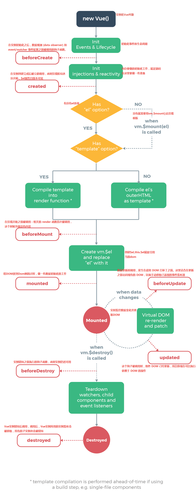
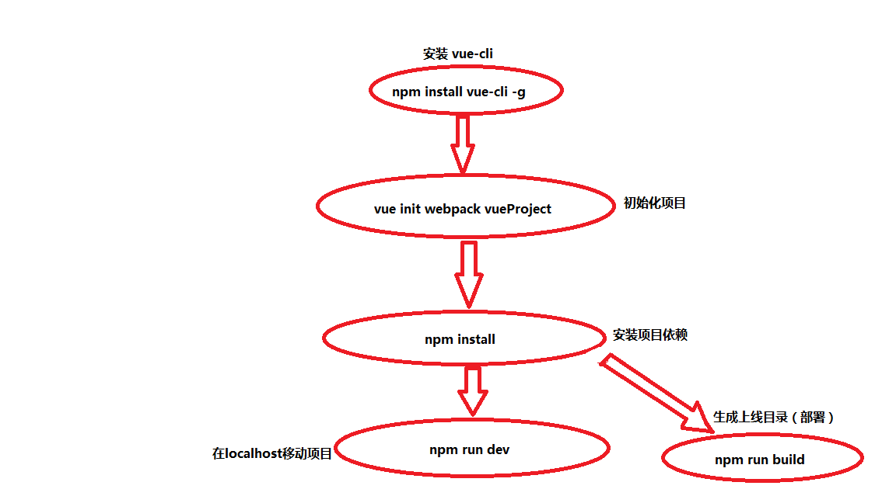
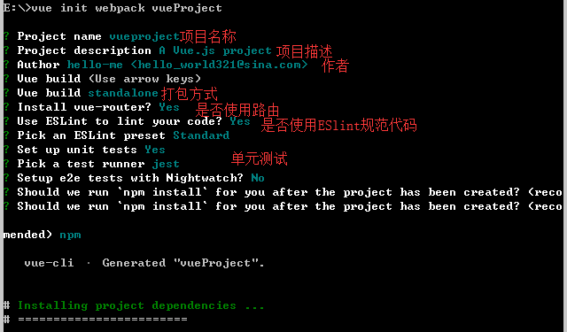

 ### 关于vue.js最基本的知识点
  #### Vue是什么
   Vue是一个轻量级的前端界面框架，实现数据渲染/数据同步，组件化/模块化，路由，ajax, 数据流等功能。
  #### Vue的特点
   双向数据绑定，components注册组件，（webpack+vue-loader Browserify + vueify）打包工具将.vue文件解析成浏览器能识别的文件。
   webpack是一个现代的JavaScript应用模块打包器（module bundler），它能把各种资源，例如JS（含JSX）、coffee、样式（less/sass）、图片等都作为模块来处理和使用。它有着难以置信的配置和神奇的效果，大大提高了我们程序员的工作效率
  #### 生命周期：
   一个组件或者实例对象在不同的阶段，vue.js提供不同的钩子，通过这些钩子在特定的阶段执行一些特定的操作
   
  #### 一些基本知识
   ##### v-text 与 v-html的区别
   v-text: 会把html的标签输出
   v-html: 不会把html的标签输出
   比如：
   ```
   <template>
     <div id="app">
       <h1 v-html="title"></h1>
     </div>
   </template>
   
   <script>
   
   export default {
     data:function(){
       return {
         title:"<span>hello world</span>"
       }
     }
   }
   </script>
   使用v-html会输出：hello world
   使用v-text会输出：<span>hello world</span>
   ```
   ##### v-if 与 v-show的区别
   v-if 当值为 true时，显示元素 ，当值为false时，该元素消失，代码也会消失，相当于将代码在文档流里删除了，当在为true时，页面会重新渲染该元素; 
   v-show 是控制的隐藏出现，只是将css属性设为了display：none 或block;
   ##### 三种组件之间交互的方式
   1.通过属性向内传递props;
   2.子组件，通过this.$emit('function', params)触发一个事件，父组件通过监听事件来得到子组件的信息;
   3.slot插槽，写在父组件的模板通过插槽展现在子组件内(默认slot，具名slot);
   例如：
    ```
    子组件
     <slot name="header"></slot>
     <slot></slot>
     父组件
     <p slot="header">header</p>
     <p>hello world</p>
     渲染结果
     <p>header</p>
     <p>hello world</p>
    ```
   ##### VUE自定义指令
   1.全局的自定义指令
   2.局部的自定义指令
   ###### 全局的注册方式
    通过 Vue.directive( id, [definition] ) 方式注册全局指令，第一个参数为自定义指令名称（指令名称不需要加 v- 前缀，默认是自动加上前缀的，使用指令的时候一定要加上前缀），第二个参数可以是对象数据，也可以是一个指令函数。
    例如：
    ```
     <div id="app">
         <p v-color="red">全局注册自定义指令</p>
     </div>
     <script>
         Vue.directive("color", {
             inserted: function(el, binding){
                 el.style.color = binding.value
             }
         })
         new Vue({
             el: "#app"
         })
     </script>
    ```
   ###### 局部注册
    通过在Vue实例中添加 directives 对象数据注册局部自定义指令
    ```
    <div id="app">
      <p v-color="red">局部注册自定义指令</p>
    </div>
    <scritpt>
      directives: {
      color: {
       inserted: function (el, binding) {
      el.style.color = binding.value
        }
       }
      }
      </scritpt>
      ```
   ###### 钩子函数
   .el：指令所绑定的元素，可以用来操作DOM
   .binding： 绑定的一些变量，是一个对象，有很多属性
   .inserted：被绑定元素插入父节点时调用 (仅保证父节点存在，但不一定已被插入文档中)
   .update：所在组件的 VNode 更新时调用，但是可能发生在其子 VNode 更新之前。指令的值可能发生了改变，也可能没有。但是你可以通过比较更新前后的值来忽略不必要的模板更新 
   .componentUpdated：指令所在组件的 VNode 及其子 VNode 全部更新后调用
   .unbind：只调用一次，指令与元素解绑时调用,用来解除监听事件的。
   [具体的可以看官网自定义指令](https://cn.vuejs.org/v2/guide/custom-directive.html) 
   #### 初始化一个Vue项目
   vue-cli 是Vue官方提供的脚手架工具
   ###### vue-cli使用流程
   
   ###### 使用vue-cli的优势
   .成熟的VUE项目架构设计1
   .提供本地测试服务器
   .集成打包上线
   ###### 使用vue-cli的系统要求
   .Node.js(>=4.0版本) 一个强大的JavaScript运行环境
   .Git
   . 一个能使用node的命令行终端
   ###### 安装vue-cli
   >npm install vue-cli -g 全局的安装vue-cli
   >vue init webpack vueproject 创建项目，vueproject是项目名称，自己取
   
   命令输入后，会进入安装阶段，需要输入一些信息
    
    
   
   
   
   
    