 
 ## 前言：
  好记性不如敲键盘
 #### 关于GitHub：
  .GitHub 是基于Git实现的代码托管。是世界最大的"开源"社区，我们的博客就是依托于GitHub，GitHub可以给你一个二级免费域名，这就是我们的博客。
 #### 关于Hexo：
  .Hexo 是一个快速，简洁且高效的博客框架。在本地电脑上写了文章，然后就可以通过hexo命令来发布文章啦。
 ## 安装环境与工具：
  .[安装Node.js](https://nodejs.org/en/download/)下载安装你对应系统的即可，最新的node.js在安装的过程中会自动配置你的环境变量.
  .[安装Git](https://git-scm.com/download/win) 下载完成，在命令行输入git version 有输入版本说明安装成功.
  #### Git的基本操作
  .git clone: 将远程仓库复制到本地： git clone 项目地址
  .git init: 新建一个仓库
  .git pull: 抓取远程仓库所有分支更新并合并本地
  .git add: 跟踪新文件： git add 文件名/文件夹名
  .git commit: 提交你的修改： git commit -m "注释"
  .git push: 推送你本地仓库的更新到远程仓库git push[远程名][本地分支]:[远程分支]
  #### Hexo安装
   点击左下角开始在程序中找到Git Base
     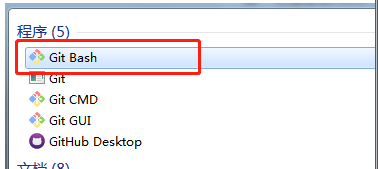
  > npm install hexo-cli -g
  > npm install hexo-deployer-git --save
  
   如下图表示完成
     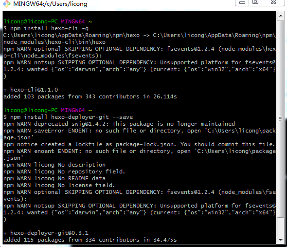
   #### Hexo初始化配置  
  
   首先创建Hexo文件夹(D\Hexo)进入文件夹点击鼠标右键，选择Git Bash Here，输入
   >hexo init
   
   Hexo目录如下
   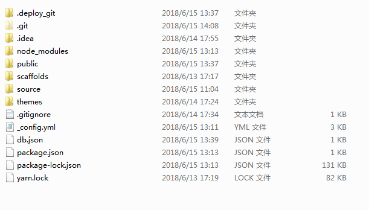
    执行以下命令，就可以在本地查看效果了
   >hexo generate
   >hexo server
   #### 登录GitHub账号新建仓库
    
   登录完成后，就可以新建[(Repository)仓库](https://github.com/new)了，
    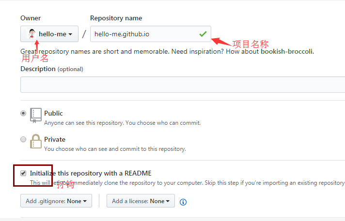
    tip：项目的名字必须是：username.github.io，里面的username和你github账号的username一致，大小写不要紧
    点击确定，就可以创建成功了。
   #### 配置SSH密钥
   
   1.先检查一下本机是不是存在SSH keys.打开Git Bash
   > cd ~/. ssh
   
   2.不存在这个目录就要创建一对SSH秘钥了。输入以下命令就可以创建了(存在的话可以直接进行第三步)
   >ssh-keygen -t rsa -C "your_email@example.com"
   
   接着根据提示需要输入密码和确认密码，可以不输密码直接回车的
    输入完成后会有提示信息。
   3.然后运行以下命令，将公钥内容复制刀粘贴板上
   >clip < ~/.ssh/id_rsa.pub
   
   登录GitHub，点击头像进去 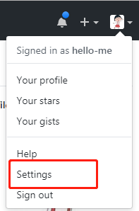
   选择  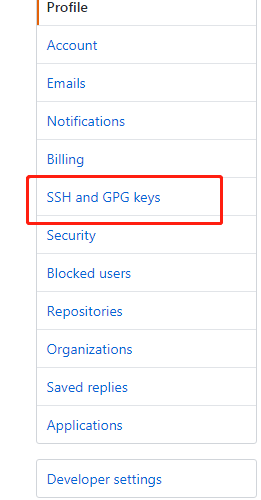 然后点击New SSH Key 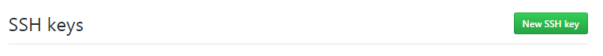
   粘贴密钥 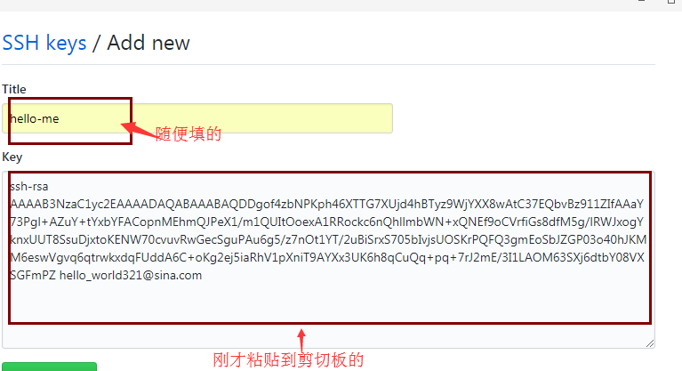
   点击添加即可
   4.输入下面命令，看看是否成功(git@github这部分不要修改)
   >  ssh -T git@github.com
   
   如果是这样子记得输入yes，不是y 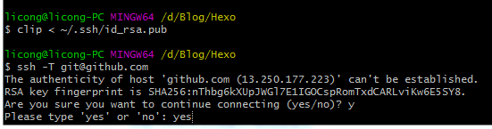
   输入yes后看到 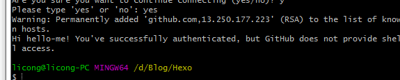就成功啦
   5.现在已经可以通过SSH链接到GitHub了，还要完善一些个人信息
   >git config --global user.name "hello-me"//用户名(自己起的)
   >git config --global user.email  "hello_world321@sina.com"//填写自己的邮箱
   #### 将本地的Hexo文件更新到Github的库中
   
   登录GitHub 打开自己开始建的的项目 username.github.io,然后如图所示操作，记得是Clone with SSH
   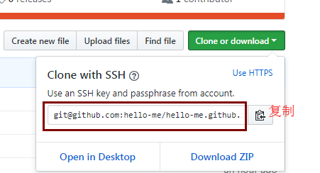
   1.打开开始创建的Hexo文件夹，用webstrom或者其他编辑器打开 _config.yml文件
    找到deploy: 字段,如图进行修改
    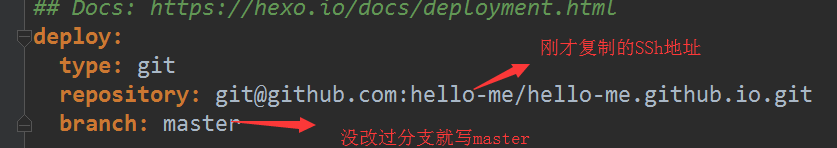
   2.在Hexo文件下执行
   > hexo g -d
   
   3.在游览器上输入自己的博客地址即可查看
   ##  美化自己的博客
    
   [Hexo官网主题](https://hexo.io/themes/)
   选一个你喜欢的主题点击名称进去，有很详细的教程教你怎么用，照着做就好了
   主题选好照着教程都把相应的配置好后，打开Hexo右键Git Bash 输入
   > hexo g
   > hexo s
   
   就可以在本地查看效果了，如果满意，打开Hexo右键Git Bash 输入
   > hexo clean
   > hexo g -d
   
   就将他部署到GitHub上了
   ## 发布博客
  执行以下命令就可以在 Hexo\source_posts中生成 .md 文档，用编辑器打开就可以写自己的想写的了。
   > hexo n "文章名称"
   
   写完后,用以下命令就可以就可以发布到我们的GitHub仓库了
   >  hexo g
   >  hexo d
    
     
